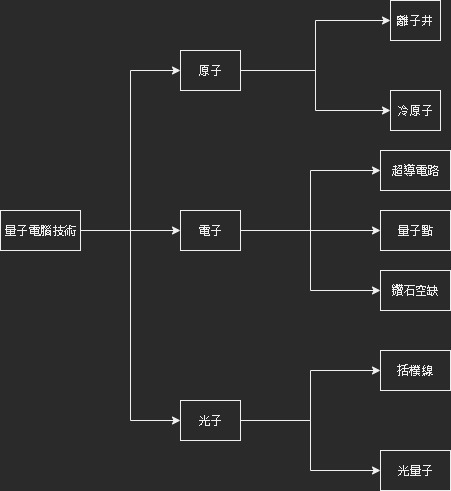
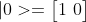
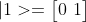
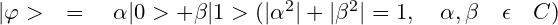
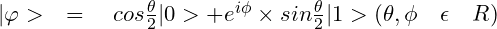

## [參考來源](https://www.youtube.com/watch?v=hXHrhnt2TEI)

# 量子物理:

## 基於普郎克的E(能量)=h(普郎克常數)*f(頻率)

## 最小單位稱為能量子(量子)

## 波爾和海森堡共同整理完成哥本哈根詮釋(歸餒所有量子物理思想)(成為量子物理界的共識)

## 分成兩派學派:

1. ## 哥本哈根學派 - 海森堡、波爾

2. ## 反對派 - 愛因斯坦、薛丁格、德布羅伊(無法解釋量子疊加家和量子糾纏)

# 量子電腦實現:

## 須找出有量子特性的材料:原子、電子、光子...

# 量子邏輯閘

## 一般電腦最小單位為bit(0或1)，而量子電腦最小單位為qubit(0和1疊加)

## 量子位元以狄拉克表示法表示:

## 也有用兩種視覺化表示法:

1. ## Hilbert Space (二維表示)
   
   

2. ## Bloch Sphere(三維表示)
   
   

看到5:29
